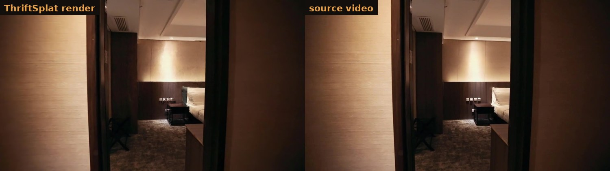
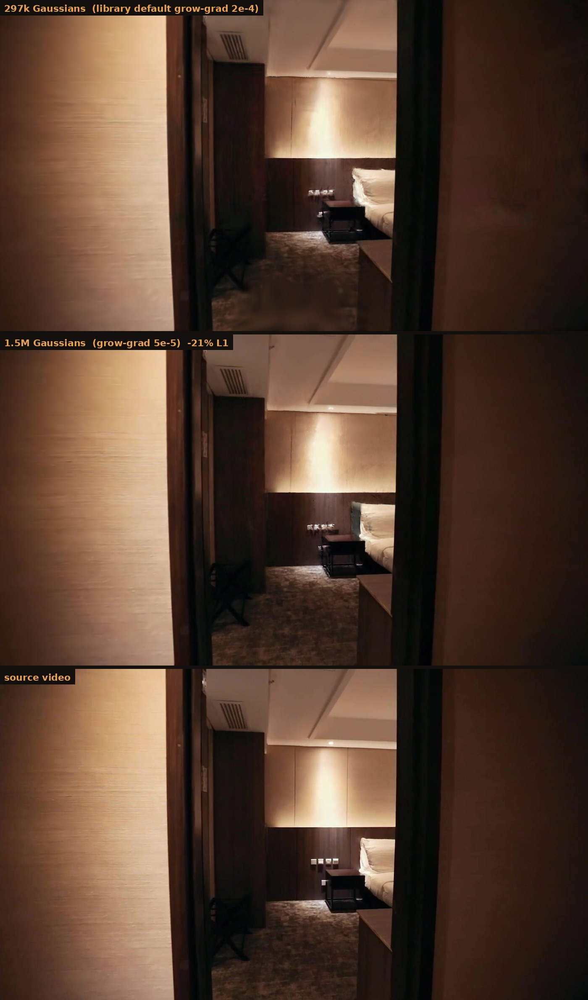
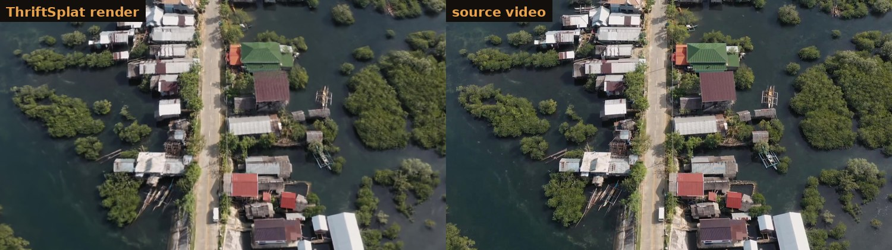

# ThriftSplat

Video in, 3D Gaussian splat out, on a 6 GB consumer GPU.

```bash
python -m thriftsplat clip.mp4 -o myscene
```



Measured end to end on an **RTX 2060 (6 GB)** with 8 GB of usable system RAM:

| clip | frames | point cloud | splat | total | peak VRAM |
|---|---|---|---|---|---|
| 21 s indoor | 37 | 2.2 min | 42.2 min | 44 min | 3.39 GB |
| 23 s aerial | 80 | 4.4 min | 61.2 min | 66 min | 3.39 GB |

No COLMAP, no cloud, no depth sensor. Just a video file.

---

## Why this exists

The usual Gaussian splatting pipeline has two costs that keep it off small machines.

**Camera poses.** Structure from motion (COLMAP) can take tens of minutes to hours, and it fails outright on footage with weak parallax, which is most handheld video. ThriftSplat uses [MapAnything](https://github.com/facebookresearch/map-anything), a feed forward model that predicts metric geometry and poses in a single pass. Pose estimation drops to about 2 minutes and works on footage where SfM gives up.

**VRAM.** Published guidance puts 6 GB at the *minimum* threshold for basic 3DGS, and MapAnything's own documentation quotes 2000 views on 140 GB. Neither the reconstruction model nor the splat trainer fits on a 6 GB card out of the box. Making them fit is most of what this repository is.

The stack itself (MapAnything for pose, [gsplat](https://github.com/nerfstudio-project/gsplat) for training) is a known good combination and is recommended elsewhere. **What is here is a working low VRAM implementation of it, with the failure modes measured rather than guessed.**

---

## What this adds

### 1. MapAnything on 6 GB

The model is DINOv2 ViT-g/14. In fp32 the weights alone occupy 4.91 GB, leaving 0.42 GB free on a 6.14 GB card, so inference cannot run at all.

- **fp16 does not work.** ViT-g activations exceed the fp16 exponent range and every output comes back NaN (measured: 456876 of 456876 ray values).
- **bf16 works**, because it carries fp32's exponent range. On pre Ampere cards there are no bf16 tensor cores so it runs through emulation, which is slower but correct.
- Three places in the upstream code assume fp32 weights and need bridging: a camera encoder that builds fp32 tensors outside any autocast region, a pose matrix built with `torch.eye(4)` and no `dtype=`, and a postprocessing step that calls `.numpy()` (numpy has no bfloat16).

Weights are cast on the CPU *before* moving to the GPU. Casting afterwards leaves the discarded fp32 blocks in the caching allocator: 2.46 GB of live weights but only 0.39 GB free.

See [`thriftsplat/lowvram.py`](thriftsplat/lowvram.py).

### 2. Chunked reconstruction with orientation based alignment

A 6 GB card fits roughly **700k pixels per forward pass**, which is 4 views at native 518 px. Long videos must be processed in overlapping chunks and stitched.

Chunks cannot be aligned on camera centres alone. When a camera moves in a near straight line (a dolly, a nadir drone pass) the shared centres are close to collinear, which leaves roll about the motion axis unconstrained. The result is chunks placed correctly but rolled randomly, producing a radial fan instead of a room. Aligning on full camera orientations fixes it and needs only 2 shared frames instead of 3.

Because MapAnything predicts metric scale, chunk to chunk scale is locked to 1 (`--rigid`). Leaving scale free let one bad chunk fit a factor of 0.155 and drag the whole track with it.

### 3. Two independent memory ceilings, both instrumented

- **VRAM** scales with Gaussian count, and it is **superlinear**: 2.29M Gaussians took 4.35 GB but 2.41M took 5.34 GB. A 5% increase in count cost 23% more memory. Never extrapolate a safe cap from early iterations.
- **Host RAM** scales with frame count. Training images are stored as uint8 and loaded in batches. As float32 in pinned memory, 80 frames plus a 4.1M point cloud got the trainer OOM killed by the kernel inside an 8 GB WSL cap, with no traceback at all.

Fixing one by moving data to the other just relocates the ceiling. Both are checked.

### 4. A capture quality metric that actually predicts results

Reconstruction quality tracks the **perpendicular** baseline to depth ratio, not the raw one. Motion along the view axis produces almost no parallax however far the camera travels.

Across three clips, raw baseline/depth ranked them **backwards** (Spearman -0.50) while perpendicular baseline/depth ranked them perfectly (+1.00, n=3, so suggestive rather than established). Every run now prints it before you commit to training:

```
parallax : perpendicular baseline/depth = 0.0087  (LOW - expect soft geometry)
           camera moved mostly ALONG its view axis. Arc or strafe instead of dollying straight in.
```

Related: **chunk stitch residual is not a quality metric.** One clip had the best stitching of the three (5.4 mm) and the worst geometry. Chunks can agree perfectly on geometry that is wrong.

### 5. Joint camera pose refinement

Chunk stitching leaves residual drift, measured at about 12 px across a 37 frame track. 3DGS bakes that in as permanent blur, so a learnable 6 DoF delta per camera is optimised alongside the Gaussians. It converges to roughly 0.5 degrees mid track rising to 2.8 degrees at the ends, matching the drift measured independently by reprojection.

---

## Where this runs

| | requirement |
|---|---|
| GPU | NVIDIA, 6 GB VRAM or more, compute capability 7.0+ |
| CUDA | toolkit 12.4 (needs `nvcc`; gsplat JIT compiles its kernels) |
| System RAM | 8 GB usable |
| Disk | about 10 GB (4.6 GB of weights plus outputs) |
| OS | Linux, or Windows via WSL2 |
| Python | 3.10 or newer |

Developed and measured on an RTX 2060 6 GB under WSL2 Ubuntu 22.04, 8 GB RAM cap, 4 cores. It will run faster on anything larger; the memory work is what makes the small end possible.

Pre Ampere cards (GTX 16xx, RTX 20xx) run the reconstruction model in emulated bf16. Correct, just slower.

---

## Install

```bash
git clone https://github.com/YOURNAME/thriftsplat.git
cd thriftsplat
./install.sh
```

The script checks prerequisites, pins the versions that must be pinned, and explains each one. If `nvcc` is missing it prints the exact command for your platform and stops.

```bash
export HF_HUB_DISABLE_XET=1        # the Xet backend deadlocks on some WSL2 setups
export CUDA_HOME=/usr/local/cuda-12.4
export PATH="$PWD/.venv/bin:$CUDA_HOME/bin:$PATH"
```

First run downloads about 4.6 GB of weights and spends 10 to 20 minutes compiling gsplat kernels. Both are one time.

---

## Usage

```bash
# everything
python -m thriftsplat clip.mp4 -o myscene

# reconstruction only, to check the parallax report before committing an hour
python -m thriftsplat clip.mp4 -o myscene --stage cloud

# retrain the splat without redoing reconstruction
python -m thriftsplat clip.mp4 -o myscene --stage splat --iters 20000
```

Output:

```
myscene/scene/points.ply      metric point cloud, colour per point
myscene/scene/scene.json      camera poses, chunk stitch diagnostics, parallax report
myscene/scene/frame_*.npz     13 fields per frame: pts3d, depth, rays, intrinsics, conf, masks
myscene/splat/splat.ply       the splat, standard 3DGS format
myscene/splat/preview_*.jpg   render beside ground truth, every 2500 iterations
```

Open `splat.ply` in [SuperSplat](https://superspl.at/editor), PlayCanvas, or a Blender 3DGS addon.

### Tuning

The single most useful knob is `--grow-grad`, and it is not the one you would expect:

| lever | measured effect on L1 |
|---|---|
| `--grow-grad 5e-5` instead of the library default `2e-4` | **-21%** |
| training width 1554 to 1890 | -3% |
| sparse versus dense initial cloud | no difference |
| feeding the reconstruction model larger images | **worse** (detail per pixel drops 39%) |



`grow_grad2d` is the densification threshold, and at the library default it stalls Gaussian growth around 300k so `--cap` never binds. Watch the printed `N` while training:

- **N well below `--cap`** means the threshold is binding. Lower `--grow-grad`.
- **N pinned at `--cap`** means memory is binding. Raise `--cap` carefully, one step at a time, because the memory curve is superlinear.

Aerial scenes tend to be cap limited, indoor scenes tend to be threshold limited.

---

## What this cannot do

Being direct about the ceiling, because no flag fixes it.

**Geometry resolution.** MapAnything ships resolution sets of 504, 512 and 518 px, so its depth is about 0.15 MP per view. A 1080p source is 2.07 MP, meaning **92.7% of every frame never reaches the geometry**. That is a property of the model, not of your GPU, and feeding it larger images makes detail per pixel worse rather than better. [HD-VGGT](https://arxiv.org/html/2603.27222v1) addresses this directly with a dual branch design and would be the front end to swap in.

**Capture parallax.** This dominates everything tunable. Two clips measured:

| clip | perpendicular B/D | detail reproduced |
|---|---|---|
| indoor, sideways motion | 0.0226 | 0.894 |
| aerial, near nadir | 0.0189 | 0.599 |

A 16% difference in parallax produced a 33% difference in reproduced detail, far more than any training setting moved. Arc or orbit rather than dollying straight in.



**Nadir aerial scale drift.** With no horizon in frame, "camera higher and scene farther" renders almost identically to "camera lower and scene nearer". Measured on drone footage: estimated altitude wobbled 0.100 m per frame while the drone actually moved 0.104 m laterally, and flat water reconstructed with 0.405 m of undulation. This is a known open problem; see [AeroDGS](https://cvpr.thecvf.com/virtual/2026/poster/37659) and [AerialMetric](https://arxiv.org/html/2606.29716v2). Trajectory smoothness and ground plane priors are not implemented here.

**Lossy compression is available and cheaper than it sounds.** See the section below.

---

## Compression

Both files are written by default. `splat.ply` is lossless float32 and is the
master copy; `splat_compressed.ply` uses gsplat's quantised format, which is
what SuperSplat prefers to load.

Measured on a 1.5M Gaussian scene rather than inferred from the bit depths:

| | value |
|---|---|
| size | 5x smaller (450 MB to 80 MB) |
| mean position error | 1.26 mm |
| worst position error | 2.69 mm |
| as a fraction of scene extent | 0.018% |
| spherical harmonic DC error | 0.005 on a range of about 12 |
| Gaussians dropped (opacity below 1/255) | 23.5% |

The quantisation is per chunk of 256 splats, so each chunk normalises over a
small volume and 11 bits goes a long way. **1.26 mm is well under the 20 mm
voxel the input point cloud is built at**, so the positional error is below the
resolution of the geometry feeding it.

The visible effect is really the opacity cull, which removes Gaussians that
were contributing almost nothing. Use the compressed file for sharing and web
viewers, and keep the plain `.ply` as the master. Disable with `--compress 0`.

## Notes for anyone hitting the same walls

Things that cost real time to diagnose and are not documented anywhere obvious:

- `gsplat`'s `MCMCStrategy` injects a random walk into Gaussian means scaled by `means_lr * noise_lr` (default 5e5). With a constant learning rate that scaler never decays and the scene detonates; Gaussians ended up 100 km from a 5 m room. Use `DefaultStrategy`, and decay the means learning rate regardless.
- `export_splats` writes whatever you hand it. The 3DGS `.ply` convention stores **raw** parameters (log scales, logit opacity) and the viewer applies the activations. Passing activated values makes every viewer double apply them, giving splats roughly 88x too large.
- MapAnything's preprocessing snaps both image dimensions to the ViT patch size of 14, which can change the aspect ratio. Intrinsics then need **per axis** scaling. A single factor leaves `fy`/`cy` about 0.8% off, which never crashes and quietly degrades every frame. Aspect exact sizes are exactly `k*(518x294)`.
- The README claim that bf16 "falls back to fp16 if unsupported" misfires on pre Ampere cards, because `torch.cuda.is_bf16_supported()` returns True through the emulation path.
- HuggingFace downloads can hang forever on WSL2 with mirrored networking. The Xet backend opens connections and transfers nothing, parked in `futex_do_wait`. `HF_HUB_DISABLE_XET=1` fixes it.

---

## Licence and credits

ThriftSplat is Apache 2.0.

Built on [MapAnything](https://github.com/facebookresearch/map-anything) (use the `facebook/map-anything-apache` checkpoint for commercial work; the default checkpoint is CC-BY-NC 4.0) and [gsplat](https://github.com/nerfstudio-project/gsplat) (Apache 2.0). Neither project is affiliated with this one.
